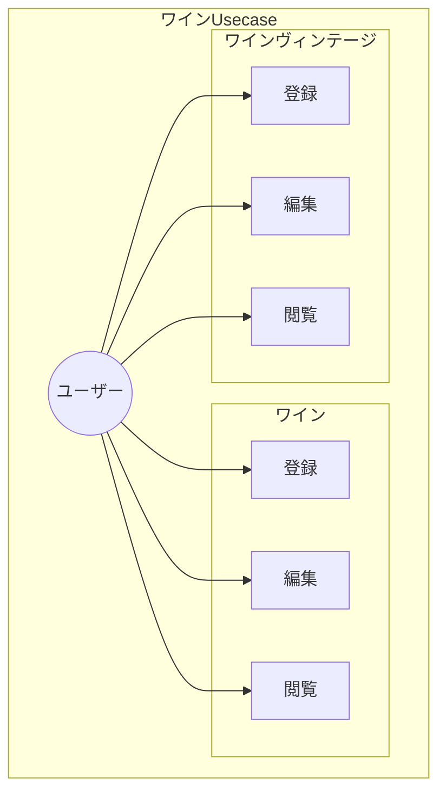

```mermaid
graph TB
    subgraph "ワインUsecase"
        User((ユーザー))
        subgraph "ワイン"
            AddWine[登録]
            EditWine[編集]
            ViewWine[閲覧]
        end
        subgraph "ワインヴィンテージ"
            AddWineVintage[登録]
            EditWineVintage[編集]
            ViewWineVintage[閲覧]
        end
    end
    
User --> AddWine
User --> EditWine
User --> ViewWine
User --> AddWineVintage
User --> EditWineVintage
User --> ViewWineVintage
```
