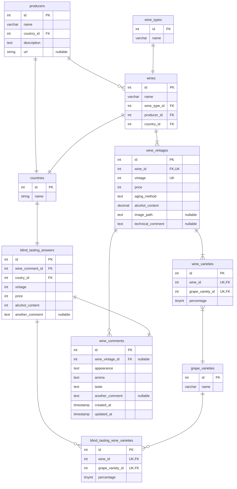

```mermaid
erDiagram
    producers {
        int id PK
        varchar name
        int coutnry_id FK
        text description 
        string url "nullable"
    }
    
    wines {
        int id PK
        varchar name
        int wine_type_id FK
        int producer_id FK
        int country_id FK
    }
    
    wine_types {
        int id PK
        varchar name
    }
    
    wine_vintages {
        int id PK
        int wine_id FK,UK
        int vintage UK
        int price
        text aging_method
        decimal alcohol_content
        text image_path "nullable"
        text technical_comment "nullable"
    }
    
    countries {
        int id PK
        string name
    }
    
    wine_varieties {
        int id PK
        int wine_id UK,FK
        int grape_variety_id UK,FK
        tinyint percentage
    }
    
    grape_varieties {
        int id PK
        varchar name
    }
    
    wine_comments {
        int id PK
        int wine_vintage_id FK "nullable"
        text appearance
        text aroma
        text taste
        text another_comment "nullable"
        timestamp created_at
        timestamp updated_at
    }
    
    blind_tasting_answers {
        int id PK
        int wine_comment_id FK
        int coutry_id FK
        int vintage
        int price
        int alcohol_content
        text another_comment "nullable"
    }

    blind_tasting_wine_varieties {
        int id PK
        int wine_id UK,FK
        int grape_variety_id UK,FK
        tinyint percentage
    }
    
    
    producers ||--o{ wines : ""
    producers ||--|| countries : ""
    wines ||--|{ wine_vintages : ""
    wines ||--|| countries : ""
    wine_vintages ||--|{ wine_varieties : ""
    wine_varieties }|--|| grape_varieties : ""
    wine_types ||--|| wines : ""
    wine_vintages ||--o{ wine_comments : ""
    countries ||--|| blind_tasting_answers : ""
    blind_tasting_answers ||--|| wine_comments : ""
    blind_tasting_answers ||--o{ blind_tasting_wine_varieties : ""
    grape_varieties ||--o{ blind_tasting_wine_varieties : ""
```
