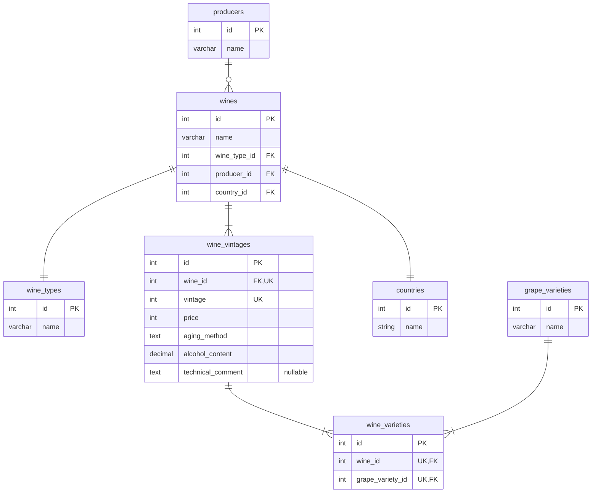

```mermaid
erDiagram
    producers {
        int id PK
        varchar name
    }
    
    wines {
        int id PK
        varchar name
        int wine_type_id FK
        int producer_id FK
        int country_id FK
    }
    
    wine_types {
        int id PK
        varchar name
    }
    
    wine_vintages {
        int id PK
        int wine_id FK,UK
        int vintage UK
        int price
        text aging_method
        decimal alcohol_content
        text technical_comment "nullable"
    }
    
    countries {
        int id PK
        string name
    }
    
    wine_varieties {
        int id PK
        int wine_id UK,FK
        int grape_variety_id UK,FK
    }
    
    grape_varieties {
        int id PK
        varchar name
    }
    
    
    producers ||--o{ wines : ""
    wines ||--|{ wine_vintages : ""
    wines ||--|| countries : ""
    wine_vintages ||--|{ wine_varieties : ""
    grape_varieties ||--|{ wine_varieties : ""
    wines ||--|| wine_types : ""
```
